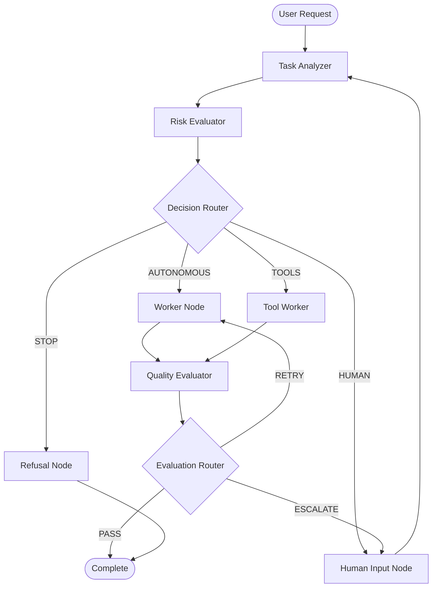

# Autonomous Decision Engine (ADE)

A **Human-in-the-Loop AI Decision System** built with LangGraph that intelligently decides whether an AI should act autonomously, use tools, request human input, or refuse to proceed.

## Why This Matters

### The Problem with Uncontrolled AI Autonomy

Modern AI systems are increasingly capable, but with capability comes risk:

- **Irreversible Actions**: AI can submit forms, send emails, or make purchases before humans realize what's happening
- **Credential Exposure**: AI agents may request or store sensitive login information
- **Hallucination Risk**: AI can confidently present false information in high-stakes situations
- **Consent Violations**: AI may take actions the user didn't explicitly authorize
- **Audit Opacity**: Without proper logging, it's impossible to understand what decisions were made and why

### The Solution: Structured Decision-Making

The Autonomous Decision Engine provides a framework where:

1. Every task is analyzed for risk before execution
2. High-risk actions require explicit human confirmation
3. Every decision is logged with clear reasoning
4. Dangerous requests are safely refused with explanations
5. The human always remains in control

## Architecture



## Decision Types

| Decision | Risk Level | Description |
|----------|------------|-------------|
| **AUTONOMOUS** | Low (< 0.3) | AI proceeds without human intervention |
| **TOOLS** | Medium (0.3 - 0.5) | AI uses tools with oversight |
| **HUMAN** | High (0.5 - 0.7) | Requires explicit human confirmation |
| **STOP** | Critical (> 0.7) | Refuses to proceed, explains why |

## Risk Categories

The system evaluates risk across six dimensions:

1. **Legal**: Contracts, visas, official documents
2. **Financial**: Payments, scholarships, investments
3. **Ethical**: Privacy, consent, discrimination
4. **Hallucination**: Factual claims requiring verification
5. **Authentication**: Login-protected workflows
6. **Irreversible**: Actions that cannot be undone

## State Schema

```python
class ADEState(TypedDict):
    task_input: str                    # Original user request
    task_analysis: TaskAnalysis        # Domain, complexity, requirements
    risk_assessment: RiskAssessment    # Risk scores and reasoning
    decision: DecisionType             # AUTONOMOUS | TOOLS | HUMAN | STOP
    messages: list                     # Conversation history
    work_output: str                   # Final output
    evaluation: EvaluationOutput       # Quality assessment
    decision_path: list[DecisionRecord] # Audit trail
    thread_id: str                     # Session identifier
```

## Campus France Workflow

The system includes specialized handling for Campus France scholarship applications:

### Automatic Detection
Tasks containing keywords like "Campus France", "études en France", "Eiffel scholarship" trigger the Campus France workflow.

### Safety Constraints
- **No credential storage**: User credentials are never saved
- **Human login required**: The AI cannot log into the portal
- **Submission confirmation**: Final submissions require explicit human action

### Assisted Steps
The AI can help with:
- ✅ Researching programs and requirements
- ✅ Preparing CV (French format guidance)
- ✅ Writing motivation letters
- ✅ Creating study projects
- ✅ Reviewing documents

### Human-Required Steps
- ❌ Logging into the portal
- ❌ Submitting applications
- ❌ Entering credentials

### Example Walkthrough

```
User: Help me apply for a Campus France scholarship

1. [Task Analyzer] Detected: Campus France domain
2. [Risk Evaluator] Risk: 0.65 (HIGH - scholarship application)
3. [Decision Router] → HUMAN (requires confirmation)
4. [Human Input] Displays guidance, awaits approval
5. [User] Approves: "Yes, help me prepare my documents"
6. [Worker] Provides CV template, motivation letter structure
7. [Evaluator] Quality: 0.85 (PASS)
8. [Complete] Output delivered with next steps

Decision Path:
- task_analyzer: Campus France scholarship application
- risk_evaluator: High risk, requires human oversight
- human_input: User approved assistance
- worker: Generated document guidance
- evaluator: Quality passed
```

## Safety & Ethics

### Core Principles

1. **Human Agency**: The human is always in control
2. **Transparency**: All decisions are logged and explained
3. **Consent**: High-risk actions require explicit approval
4. **Privacy**: No credential or personal data storage
5. **Reversibility**: Prefer reversible actions when possible

### What We Never Do

- ❌ Store user passwords or credentials
- ❌ Submit forms without explicit confirmation
- ❌ Make financial transactions autonomously
- ❌ Access authenticated systems on behalf of users
- ❌ Hide decision reasoning from users

### What We Always Do

- ✅ Explain why human input is required
- ✅ Log every decision with reasoning
- ✅ Provide clear refusal explanations
- ✅ Offer alternatives when refusing
- ✅ Respect user's final decision

## Installation

### Prerequisites

- Python 3.11+
- OpenAI API key

### Setup

```bash
# Clone the repository
cd autonomous-decision-engine

# Create virtual environment
python -m venv venv
source venv/bin/activate  # On Windows: venv\Scripts\activate

# Install dependencies
pip install -r requirements.txt

# Configure environment
cp .env.example .env
# Edit .env and add your OPENAI_API_KEY
```

### Running

```bash
# Interactive mode
python -m app.main

# Single task mode
python -m app.main "Research Campus France scholarship requirements"

# With session continuity
python -m app.main --thread-id my-session "Continue my application"
```

## Project Structure

```
autonomous-decision-engine/
├── app/
│   ├── main.py                 # CLI entrypoint
│   ├── config.py               # Configuration
│   ├── state/
│   │   ├── schema.py           # LangGraph State
│   │   └── enums.py            # Decision enums
│   ├── graphs/
│   │   ├── decision_graph.py   # Graph assembly
│   │   └── routers.py          # Routing logic
│   ├── nodes/
│   │   ├── task_analyzer.py    # Task classification
│   │   ├── risk_evaluator.py   # Risk assessment
│   │   ├── worker.py           # Task execution
│   │   ├── evaluator.py        # Quality gate
│   │   ├── human_input.py      # Human interaction
│   │   └── refusal.py          # Safe refusals
│   ├── tools/
│   │   ├── browser.py          # Read-only browsing
│   │   ├── search.py           # Web search
│   │   ├── document.py         # Document helpers
│   │   └── notifications.py    # Pushover notifications
│   ├── memory/
│   │   └── checkpoint.py       # SQLite persistence
│   ├── workflows/
│   │   └── campus_france.py    # Domain workflow
│   └── ui/
│       └── cli.py              # CLI interface
├── docs/
│   ├── architecture.md         # Technical docs
│   └── decision-flow.mmd       # Mermaid diagram
├── requirements.txt
├── .env.example
└── README.md
```

## Configuration

### Environment Variables

| Variable | Required | Default | Description |
|----------|----------|---------|-------------|
| `OPENAI_API_KEY` | Yes | - | OpenAI API key |
| `ADE_MODEL` | No | gpt-4o-mini | Model to use |
| `ADE_TEMPERATURE` | No | 0.1 | Model temperature |
| `ADE_RISK_THRESHOLD_AUTONOMOUS` | No | 0.3 | Max risk for autonomous |
| `ADE_RISK_THRESHOLD_TOOLS` | No | 0.5 | Max risk for tools |
| `ADE_RISK_THRESHOLD_HUMAN` | No | 0.7 | Max risk for human |
| `ADE_CHECKPOINT_DB` | No | ./memory.db | SQLite checkpoint path |
| `SERPER_API_KEY` | No | - | Google Serper API key |
| `PUSHOVER_TOKEN` | No | - | Pushover API token |
| `PUSHOVER_USER` | No | - | Pushover user key |

### Push Notifications

The engine sends Pushover notifications when:
- **Human input is required**: Alert when a task needs your confirmation
- **Task completes**: Notification with the final decision type

To enable, add your Pushover credentials to `.env`:
```bash
PUSHOVER_TOKEN=your-app-token
PUSHOVER_USER=your-user-key
```

## Future Extensions

### Planned Features

- [ ] Web UI (Gradio/Streamlit)
- [ ] Multi-model support (Anthropic, local models)
- [ ] Additional domain workflows (visa, legal, medical)
- [ ] Enhanced tool ecosystem
- [ ] Webhook notifications
- [ ] API mode for integration

### Extension Points

1. **New Domains**: Add workflow files in `app/workflows/`
2. **New Tools**: Add tool modules in `app/tools/`
3. **Custom Risk Rules**: Extend `risk_evaluator.py`
4. **UI Alternatives**: Replace `cli.py` with web interface

## License

MIT License - See LICENSE file for details.

## Acknowledgments

Built with:
- [LangGraph](https://github.com/langchain-ai/langgraph) - State machine for LLM applications
- [LangChain](https://github.com/langchain-ai/langchain) - LLM framework
- [Pydantic](https://github.com/pydantic/pydantic) - Data validation
- [Rich](https://github.com/Textualize/rich) - Terminal formatting

